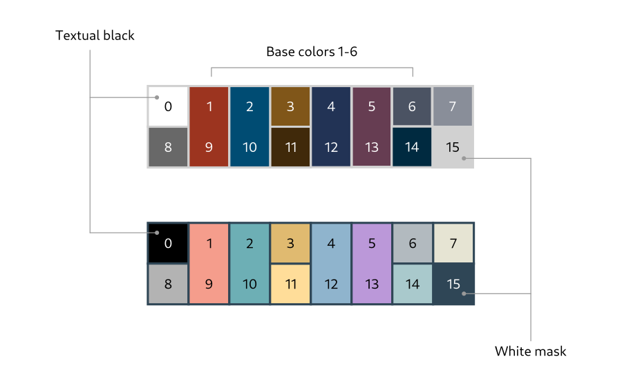
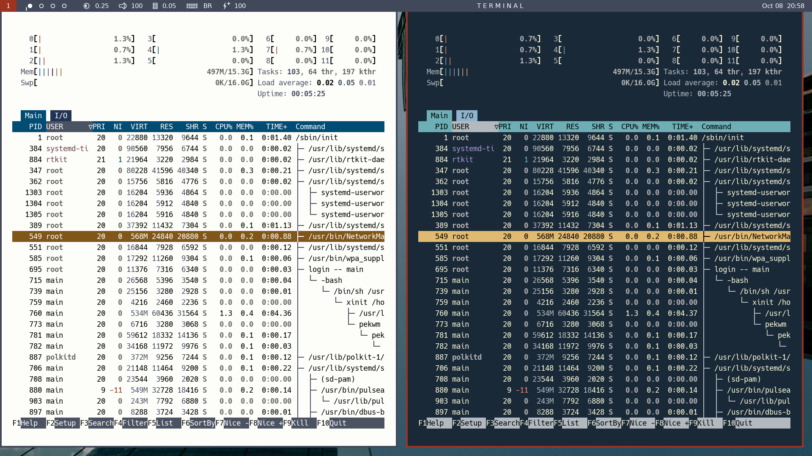
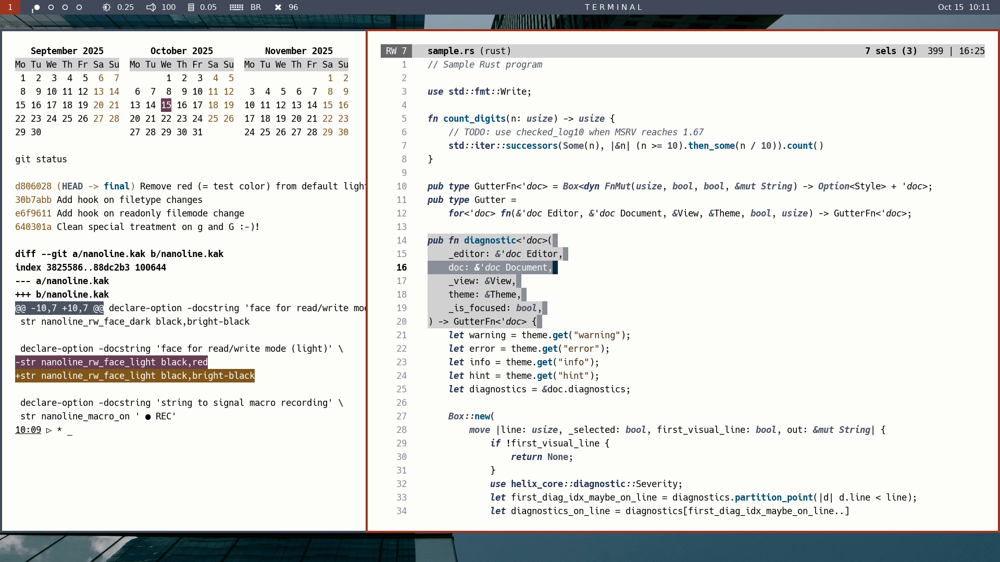
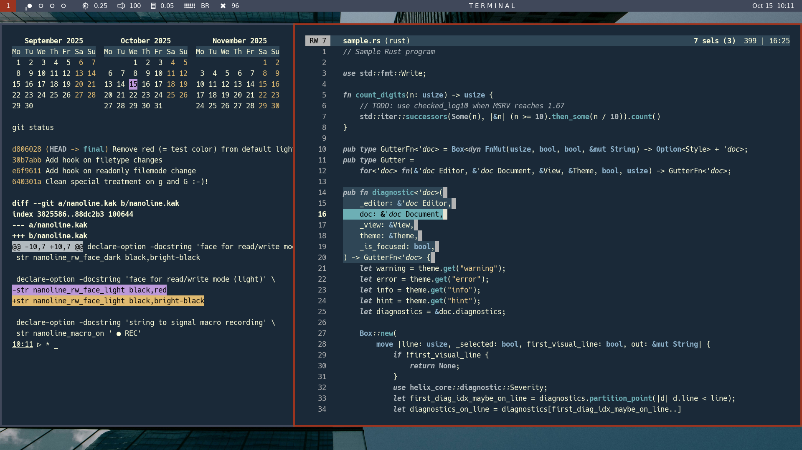

# Tangere-terminal

Tangere-terminal is a 16-color palette for UNIX terminals that combines aesthetics with
legibility. The palette avoids dissonance among hues by using complementary sectors of
the painter's color wheel, while maintaining systematically **high degrees of contrast**
between foreground and background.

As an example of palette use, here is [htop](https://github.com/htop-dev/htop) running
in two terminal windows, one with the light version of the palette (on the left),
the other with the dark version of the palette (on the right). Notice that in the
left panel, text inside highlighted lines and headers is white instead of black,
which makes the highlighted text perfectly readable.

The next two screenshots show a sample of CLIs (`cal` and `git`) in a window on
the left, along with the [Kakoune](https://kakoune.org/) editor in a window on the
right. Regardless of the palette version (light or dark), the use of a custom 16-color
theme for Kakoune makes the editor mesh well with other applications.

# Documentation

- [Design](./design/design.md) - Explanation of palette design.

- [Install](./install/install.md) - Notes on installation.

- [CLIs](./clis/clis.md) - Customization tips for CLIs.

- [Editor: Kakoune](./editors/kakoune/kakoune.md) - Support for the Kakoune editor.

- [Editor: Vim](./editors/vim/vim.md) - Support for Vim.

# Contributing

Please discuss additions and improvements to this page on GitHub, or contact me directly
by e-mail.

# License

MIT

