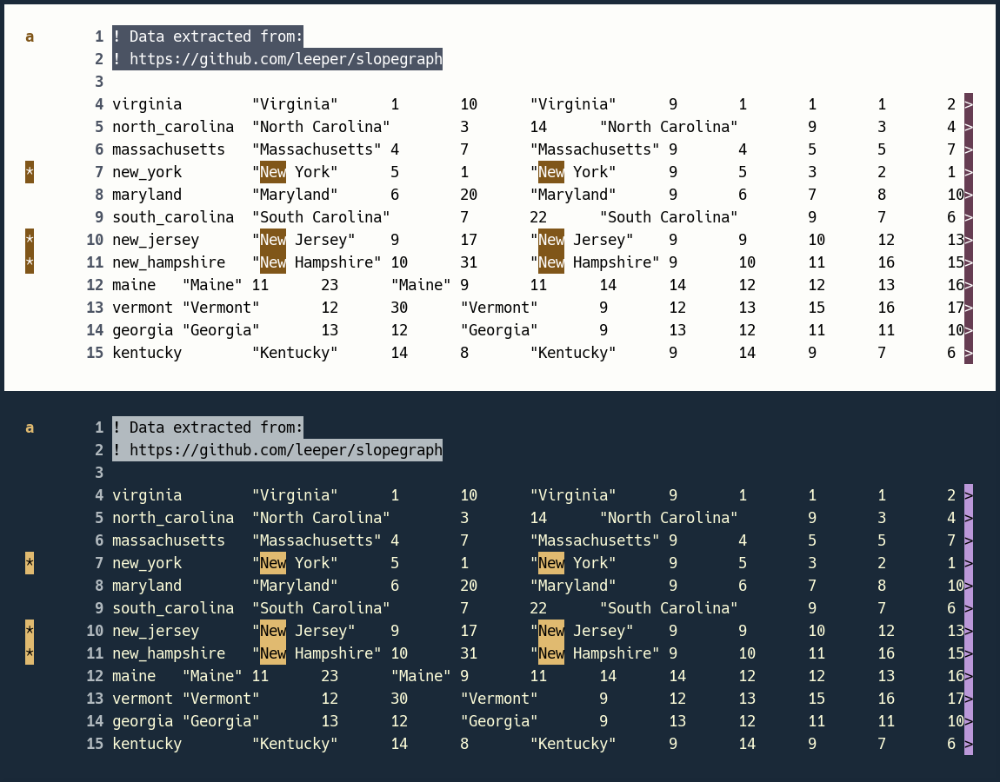
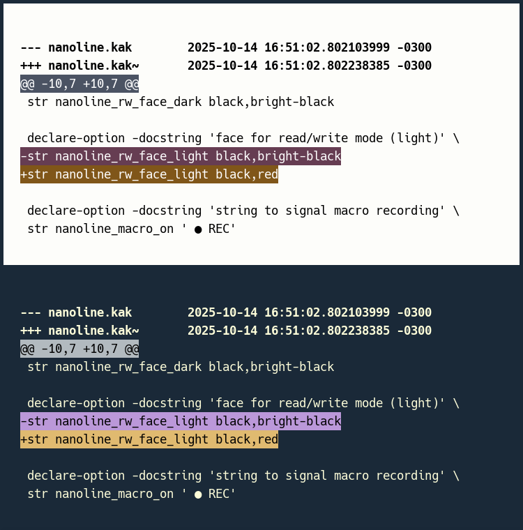
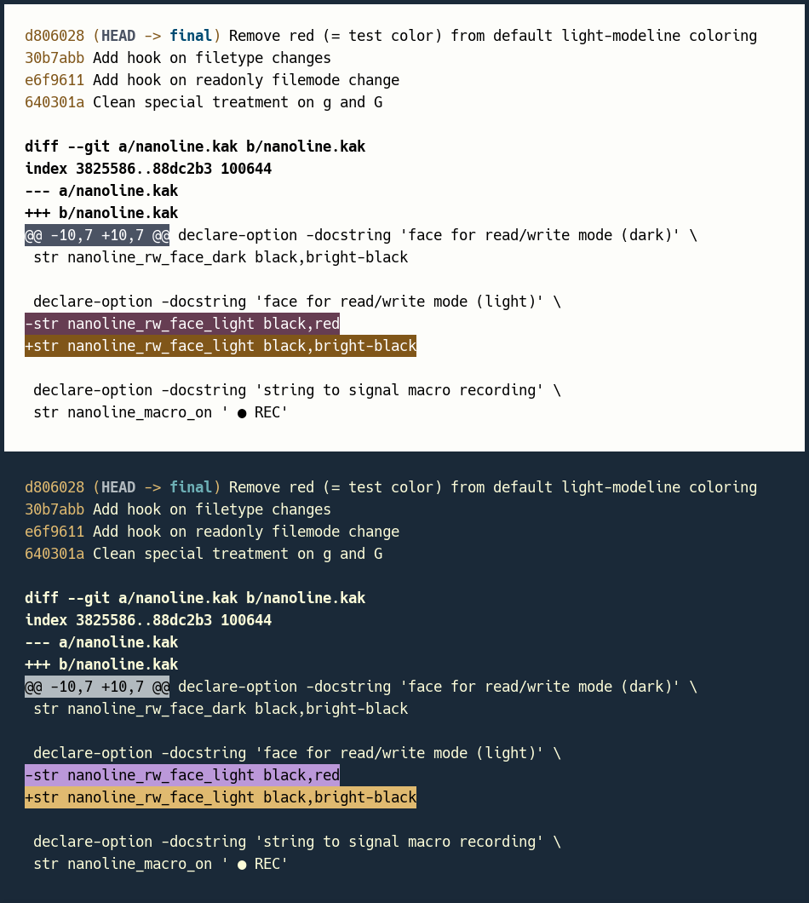
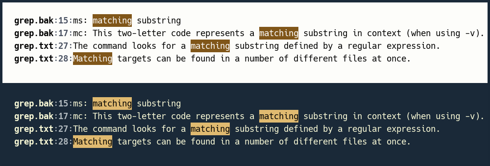

# Tips on command-line utilities

What follows is a short list of recommendations about CLI usage. These
recommendations are optional. They aim at improving readability or visual consistency across
applications.

# ls

If you use GNU `ls` with colorization, you may want to replace:

* `su=37;41` (light gray on red) by `su=30;41` (textual black on red)
* `ow=34;42` (blue on green, barely legible) by `ow=30;45` (textual black on purple)
* `st=37;44` (light gray on blue) by `st=30;44` (textual black on blue)

and:

* `pi=40;33` by `pi=33`
* `bd=40;33;01` by `bd=33;01`
* `cd=40;33;01` by `cd=33;01`
* `or=40;31;01` by `or=31;01` (to remove the black background)

inside your `LS_COLORS` environment variable (see `man dircolors`).


# less

As an example of customization, you may want to write the following in your
`.bashrc` or equivalent:

```
LESS='-FRX --use-color DEky$DHkc$DMy*$DNc$DPkc$DRkm$DSky'
export LESS
```

The string following `--use-color` is a series of color specifications. Each
specification starts with `D`, followed by a category code (e.g, `H` for headers, `N`
for line numbers) and two letters to indicate foreground and background (e.g, `g` for
green). A star means 'bold,' and a dollar sign separates a specification from the next.




# cal

Since 2023, util-linux `cal` can be colorized, but this example relies on
[calcol](https://github.com/ftonneau/calcol) (a wrapper around `cal`) for better-looking
results. Calendar headers are colorized with tangere's **white-mask category** (ANSI
color 15), a shade of gray close to, but not identical with, terminal background.


# diff

`diff` can be customized with a shell alias:

```
alias diff="diff --color=always --palette='ad=30;43:de=30;45:hd=01:ln=30;46'"
```

In this example, the colorized fields correspond to added lines (`ad`), deleted lines
(`de`), chunk headers (`hd`), and line numbers (`ln`).

This should work on GNU diff 3.4 or higher.




# git

`git` can be configured by downloading the provided [gitcolors](./gitcolors) shell script,
making it executable (`chmod +x gitcolors`), and running it from the command line:

```
./gitcolors
```

This script just runs a series of git configuration commands (see `man git-config`).




# grep 

Grep can be aliased to use colors by default:

```
alias grep='grep --color=auto'
```

Its output colors can then be customized via the GREP\_COLORS environment variable:

```
GREP_COLORS='ms=30;43:mc=:sl=:cx=:fn=01:ln=01;36:bn=32:se=36'
export GREP_COLORS
```

In this example, the colorized fields involve matching substrings (`ms`), file names (`fn`),
line numbers (`ln`), byte offsets (`bn`), and separators between output lines (`se`).



