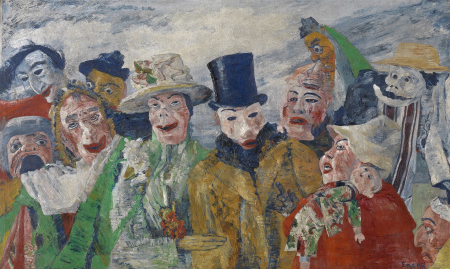
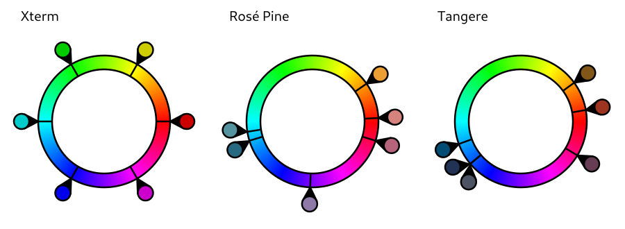

# Palette design

_Ceci n'est pas du code. Vraiment._

James Ensor, _The Intrigue_, 1890

The tangere-terminal palette comprises a foreground, a background, and the 16 ANSI
colors. The palette exists in a light and a dark version. Both versions follow the
same design principles.

# Choice of first-row colors 1 to 6

Designing a terminal palette starts with a choice of **six base colors** traditionally
known as "red," "green," "yellow," "blue," "magenta," and "cyan." These colors appear
as hues 1 to 6 on the first row of the palette.

The "xterm" palette that serves as default on many terminals is non-committal
in its choice of base colors, as they are equally distant from one another
on the HSV circle (left panel of the figure below). What works well as
[default](https://invisible-island.net/xterm/xterm.faq.html#dont_like_blue),
however, is bound to fail aesthetically. It is difficult to combine as many as
six unrelated colors harmoniously, especially if the colors are highly
saturated (which is the case with the Xterm palette).

More elegant color designs avoid filling every corner of available design space, as
can be seen with Rosé Pine Dawn (middle panel of the figure; palette obtained from the
[Gogh theme collection](https://gogh-co.github.io/Gogh/)). Instead of six equally distant
hues, Rosé Pine Dawn defines **two groups of 2 or 3 related hues** on opposite sides of the
color wheel, plus a mauve outsider at about mid-distance from the two groups. The palette
achieves its sophisticated looks via **color restriction** (in this particular case,
avoidance of pure greens) and by using saturation levels well below 100% (mean S in
Rosé Pine Dawn = 51%; mean S in Xterm = 100%).

Tangere-terminal (right panel of the figure) restricts color ranges further than Rosé
Pine Dawn by defining **two groups of 3 hues** on approximately opposite sides of
the color wheel, which makes the palette even closer to a traditional [complementary
color scheme](https://en.wikipedia.org/wiki/Complementary_colors)). The group in
the blue portion of the palette comprises nominal "green," "blue," and "cyan;" the
hues for "blue" and "cyan" are actually identical, as these colors differ only in
saturation. The group of three colors on the other side of the wheel comprises yellow,
red, and purple. The mean saturation level of base colors equals 64% (more than for
Rosé Pine Dawn, less than for Xterm).

With an average V of 45%, the six base colors are **dark** as compared
to the background of the palette, defined as a slightly yellowish white
(`#fdfdfa`). The contrast ratios of the six colors to background average 8.5 (range
= 6.3-12.3). All of these constrast ratios pass the WCAG 2.0 AA [criterion of
accessibility](https://webaim.org/resources/contrastchecker/), and five out of the
six ratios pass the AAA criterion.

The dark version of the palette follows similar design principles, although, of course,
the HSV values of the base colors differ from those of the light palette.  With V
values all above 70%, the six base colors are **light** relatively to the background
of the palette, defined as a dark blueish gray (`#1a2938`). The contrast ratios of the
six colors to background average 6.9 (range = 5.8-8.1). All of these contrast ratios
pass the WCAG 2.0 AA criterion of accessibility, and two out of the six ratios pass
the AAA criterion.

## Implications for editor theming

Discriminability being lower in the blue area of the palette, designers of themes for
text editors may want to increase distinctiveness among blue-like colors by changing
text attributes (bold/italics) as a function of syntactic category.

# Choice of second-row colors 9 to 14

Whereas many terminal palettes define colors 9 to 14 as brighter variants of colors
1 to 6, in tangere-terminal, the only columns with different first- and second-row
variants are the columns for yellow and cyan. This was done to increase the range of
options available for editor theming (see below), while maintaining the overall number
of discriminable hues as low as possible.

In the **dark** version of the palette, the colors for second-row yellow and
cyan are **brighter** than their first-row counterparts (as in traditional
palettes). In the light version of the palette, however, increasing brightness
would decrease the contrast between foreground and background and hurt
[readability](https://accessibility.huit.harvard.edu/use-sufficient-color-contrast).
Accordingly, in the **light** version of tangere-terminal, the colors for second-row
yellow and cyan are **darker** than for their first-row counterparts.

## Implications for editor theming

First-row yellow, being less contrasting that second-row yellow with respect to
the background, may be combined with a bold typeface to signal links or other text
elements that are relatively short. Non-bold, second-row yellow is best reserved for
text elements that may span several lines (e.g., a multi-line string that serves as
an awk program embedded in a shell script).

As far as second-row cyan is concerned, it can function either as a higher-contrast
grayish background (in the light version of the palette) or as a higher-contrast
blueish foreground (in the dark version of the palette).

# Choice of shades of gray 7 and 8

Following traditional 16-color terminal palettes, and in accordance with what some
CLIs expect, colors 7 and 8 (known conventionally as "white" and "bright-black")
are shades of gray, with fully gray "bright-black" being darker than "white".

# Choice of colors 0 and 15

Tangere-terminal departs most strongly from tradition in its choice of colors 0
and 15:

* color 0 is not black but **textual black**, a category guaranteed to be highly legible
when used as foreground against the six base colors. Because these colors are **light**
in the dark version of the palette (to contrast with a dark background when used as
foreground) but **dark** in the light version of the palette (to contrast with a light
background when used as foreground), textual black is **black** in the dark version
but **white** in the light version. Across both versions of the palette, the contrast
ratios of textual black to the base colors (used as background) range from 6.4 to 12.6
and average 9.1.

* color 15 is not bright-white but **white mask**, a shade of gray close to (but not
identical with) the default background. The main purpose of white mask is to serve
as additional background for text selection. The contrast ratios between colored text
and white mask (range = 3.8-8.2, mean = 5.2) are necessarily lower than those between
colored text and background, but they remain sufficiently high to guarantee text
legibility.

It is the replacement of traditional black (color 0) by textual black that explains
the readability of highlighted text in the following screenshot.

# Choice of foreground and background

The foreground color for the light and dark versions of the palette was set to `#000000`
(pure black) and `#fdfdd9` (a slightly yellowish white), respectively.

The background for the light version of tangere-terminal was set to `#fdfdfa`, a value
close to white.

Following
[this proposal](https://github.com/jan-warchol/selenized/blob/master/whats-wrong-with-solarized.md#better-lightness),
the background for the dark version of tangere-terminal was chosen to be relatively
light in HSV space; this helps avoiding uncomfortable levels of black when viewing
a dark-background terminal next to a white window. Along a convenience sample
of 30 popular dark themes for text editors (minimum V = 0, median V = 15), only
[selenized](https://github.com/jan-warchol/selenized) had a background lighter
(V = 28) than that of tangere-terminal (V = 22).

# Note on light palettes

Preferring dark palettes to light ones or vice-versa is, of course, strictly
a matter of personal taste. Avoiding light palettes for being hurtful to one's
eyes, however, is likely to involve **incorrect brightness settings**. As discussed
[here](https://blog.codinghorror.com/bias-lighting/), the factory defaults for many
LCDs involve unreasonably high brightness levels. Setting monitor brightness to 33% or
less (e.g., 25%) of the maximum level should make a light palette perfectly comfortable
after a few minutes of adaptation.

# Note on fonts

Text appearance in the terminal depends not only on colorization (as determined by
the terminal palette), but also on the typeface being displayed. For best results,
do not hesitate to try different fonts and, if possible, different font weights.
Typeface with ascenders and descenders that are too thin will render poorly.

