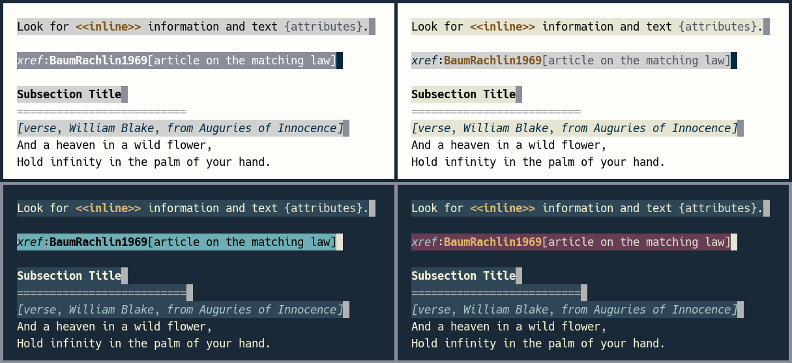
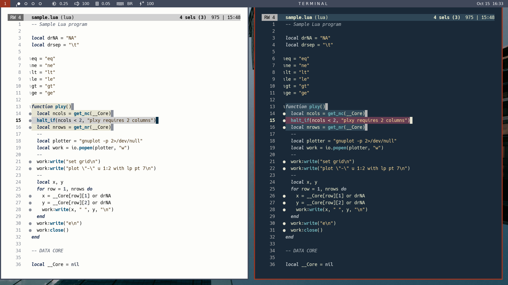
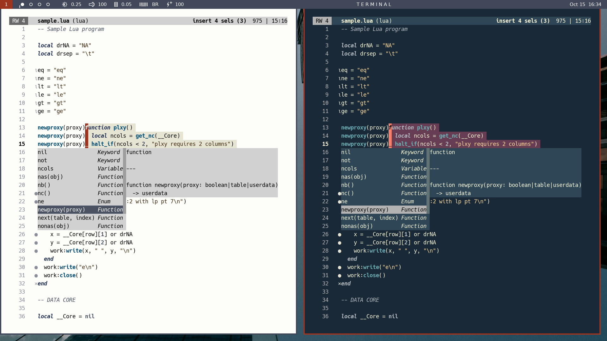
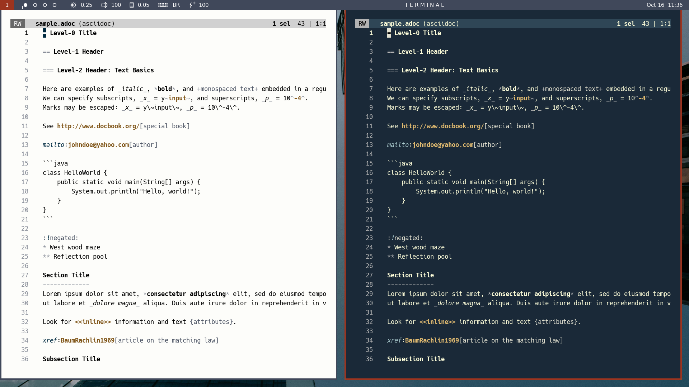

# Kakoune colorschemes

There are four tangere colorschemes for Kakoune. Two of the colorschemes are light
themes to be used with the tangere-terminal **light palette**:

- [tangere-16-light](./tangere-16-light.kak)
- [tangere-17-light](./tangere-17-light.kak)

Two other two colorschemes are dark themes to be used with the tangere-terminal
**dark palette**:

- [tangere-16-dark](./tangere-16-dark.kak)
- [tangere-17-dark](./tangere-17-dark.kak)

In each theme category (light vs. dark), the **tangere-16** colorschemes rely only on
ANSI colors 0-15, whereas the **tangere-17** colorschemes supplement ANSI colors 0-15
with an extra background.

In tangere-17-light (to be used with the light palette), this extra background equals
ANSI color 7 ("white") from the **dark** palette: a light yellow shade. In tangere-17-dark
(to be used with the dark palette), the extra background consists of ANSI color 5 from
the **light** palette: a dark magenta.

Including a 17th color as background allows the syntax highlighting of foreground
characters to remain visible against the background of primary and secondary selections
(as in [this example](https://github.com/caksoylar/kakoune-mysticaltutor)). **This 
simply cannot be done with only 16 ANSI colors**, unless one arbitrarily inverts the
brightness of one of the colors in the ANSI palette (which would break compatibility
with the remainder of the terminal/CLI ecosystem).

The next figure will drive the point home by comparing the tangere-16 and tangere-17
colorschemes in Normal mode. The comparison is made with respect to light and dark
themes (top and bottom rows, respectively). The tangere-16 themes (left side of each
row) **leave no room for syntax colorization of the primary selection**, although
boldface and italics remain visible. With the extra background included, however, the
tangere-17 themes (right side of each row) allow full syntax colorization of primary
and secondary selections.

Because the tangere-17 Kakoune colorschemes provide increased visual information on
selected text, their use is recommended.

# Shared characteristics

Regardless of whether they use 16 or 17 colors, the tangere colorschemes for Kakoune
share two main features:

* **Mode signalling**. When entering Insert mode, all cursors become red with bold text,
and the primary cursor is underlined. Maximizing the visual differences between Insert
and Normal modes minimizes the risk of mode confusion, as mode signalling is done at
the place where attention is focused (the cursor).

* **Distraction minimization**. When entering Insert mode, the colors of the primary and
secondary selections become identical, and the only remaining difference between the
primary and secondary cursors is the underlining of the primary cursor.

The following screenshots show the difference between Normal and Insert modes when
editing a Lua script with light/dark tangere-17 colorschemes and with
[kakoune-lsp](https://github.com/kakoune-lsp/kakoune-lsp) installed.

## Note on EOL cursors

As dealing visually with four different colors (primary, EOL primary, secondary, EOL
secondary) may prove more confusing than helpful, the tangere colorschemes do not
distinguish cursors in the middle of a line from cursors at the end of a line. If
you want to keep track of this distinction, the recommended course of action is to
add EOL visual marks by customizing the **show-whitespaces** highlighter (see `:doc
highlighters` in Kakoune).

# Support for asciidoc and markdown

The tangere colorscheme files include additional categories:

- adjunct
- distinct
- emphatic
- faded
- salient
- strong

loosely inspired by [this proposal](https://arxiv.org/abs/2008.06030). The new
categories are used to improve how Kakoune highlights asciidoc and markdown
documents (as in the following screenshot, for example).

These modifications will not take effect, however, unless you download the
supporting files:

- [asciidoc.kak](./asciidoc.kak)
- [markdown.kak](./markdown.kak)

and install them in your `autoload` directory tree.

# Colorscheme installation

Tangere colorschemes can be installed the standard way. If you are
interested in, say, the tangere-17-dark colorscheme, download the provided
[tangere-17-dark](./tangere-17-dark.kak) file and put it in the `colors` folder of your
`autoload` directory: `~/.config/kak/colors/`. Then write `colorscheme tangere-17-dark`
in your `kakrc`, and restart Kakoune.

## Note on colorscheme testing

Testing a colorscheme with `:colorscheme ... [ENTER]` when Kakoune is already
running may not be a good idea, as previously loaded colorschemes may interfere
with the new one. Its is better to **proceed from a clean state**, by writing
`colorscheme ...` in one's `kakrc` and restarting Kakoune (as suggested above), or by
initiating a new session with the `kak -E "colorscheme ..."` startup command.

