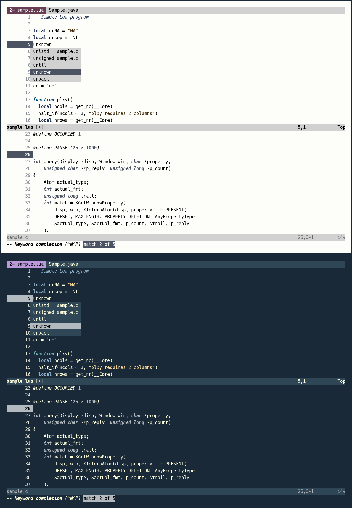
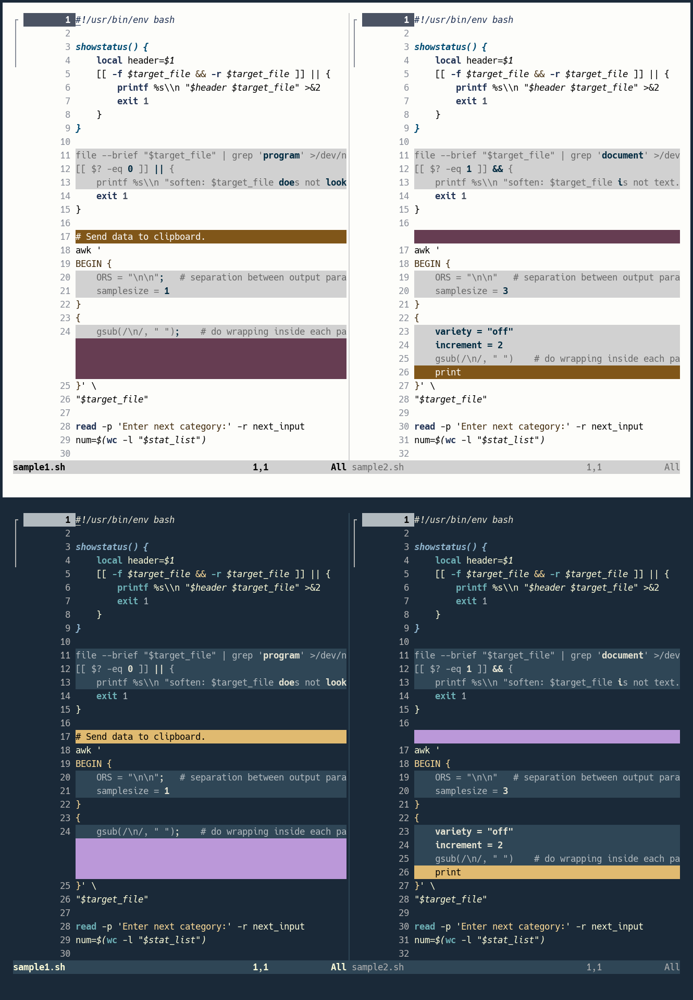

# Vim colorschemes

There are two tangere colorschemes for terminal Vim:

- [tangere-16-light](./tangere-16-light.vim), to be used with the tangere-terminal
**light palette**.

- [tangere-16-dark](./tangere-16-dark.vim), to be used with the tangere-terminal
**dark palette**.

Both colorschemes rely exclusively on ANSI colors 0-15 for syntax highlighting and user
interface elements, along the lines of [dim](https://github.com/jeffkreeftmeijer/vim-dim)
and [noctu](https://github.com/noahfrederick/vim-noctu).

The following screenshot shows what the light and dark tangere themes look like.

Special care has been taken for giving a streamlined, elegant look to `vimdiff`.
The background colors chosen for added and deleted lines are consistent with those
recommended for other [terminal applications](../../clis/clis.md).

# Installation

Download one of the provided theme files and put it in your `.vim/colors/`
directory. Then, execute the `colorscheme` command with the chosen theme name
(`tangere-16-light` or `tangere-16-dark`) as an argument.

