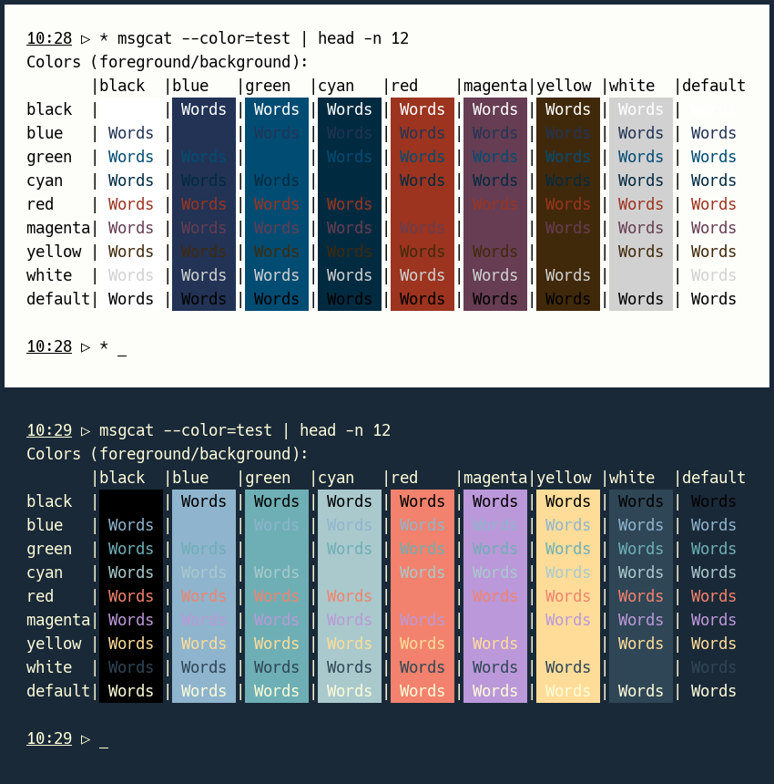

# Installation methods

There are two installation methods: static and dynamic.

A palette could be installed **statically** by copying the RGB values for background,
foreground, and colors 0-15 into the configuration file for your terminal (assuming
there is such file). The configuration file for lxterminal, for example, called
`lxterminal.conf`, is traditionally located at `$HOME/.config/lxterminal/`.

A palette could also be installed **dynamically**. The idea is to use a
shell script, `setpal`, to load the tangere-terminal palette at the time of
terminal opening; `setpal` works by sending xterm control sequences, as defined
[here](https://www.xfree86.org/4.8.0/ctlseqs.html), to the terminal.  These control
sequences are well supported today, and dynamic installation has two advantages:

* it may work even on terminals (e.g., [sakura](https://github.com/dabisu/sakura))
with only limited forms of static palette customization.

* different versions of the palette (light vs. dark) may be loaded in different
terminal instances simply by running variants of the shell script.

Dynamic installation is the **recommended method**, so we start with it.

# Dynamic installation

The first step in dynamic installation is to download the provided [setpal](./setpal)
shell script, make it executable (`chmod +x setpal`), and copy it somewhere into your
`PATH`. You will be able to check that the `setpal` command works correctly by opening
your terminal and typing `setpal l` or `setpal d` to load the palette in its light or
dark version. The background color should change immediately, and typing:

```
msgcat --color=test | head -n 12
```

should show something like this:



The last step in dynamical installation is to **automate the process of palette
loading**. Following xterm, many terminals accept an option (often flagged, `-e` or `-c`)
to execute a specific task when the terminal opens. Using sakura, here is an example of
`-e` usage that loads the dark palette on terminal opening:

```
sakura -e sh -c 'setpal d; exec bash'
```

In this example, everything after `-e` is the startup task to be executed when sakura
opens. The task consists of asking the standard shell, `sh`, to run the shell command in
single quotes after `-c`. This command in turns loads the dark version of the palette
(`setpal d`) before replacing the ongoing shell process with _bash_ (`exec bash`). As
a result, _bash_ will run in the new sakura instance until it closes.

Of course, you are free to replace `d` with `l` (if you prefer the light version of
the palette) and `bash` with your preferred interactive shell.

Finally, you may want to copy this one-liner example into a wrapper shell script to
avoid typing the example again and again.

## Note on command syntax

Some terminals require the totality of their startup command to be quoted. Using
[tilda](https://github.com/lanoxx/tilda), for example:

```
tilda -c "sh -c 'setpal d; exec bash'"
```

Notice the inclusion of single quotes (for the shell) within double quotes (for
tilda).

## Note on tmux and screen

The `setpal` script will fail on tmux unless you include the following in
your tmux configuration file:

```
set-option -ga terminal-overrides "xterm-256color:Tc"
```

Currently, it seems that GNU screen does not suppport dynamic color setting. Hence,
users of GNU screen will need to install the tangere palette **statically**.

# Static installation

The RGB values for the light palette are:

| Color category | #rrggbb       | (r,g,b) [max 255] | (r,g,b) [max 65535] |
|----------------|---------------|-------------------|---------------------|
| Foreground     | #000000       | (0,0,0)           | (0,0,0)             |
| Background     | #fdfdfa       | (253,253,250)     | (65021,65021,64250) |
| Color0         | #ffffff       | (255,255,255)     | (65535,65535,65535) |
| Color1         | #9c341f       | (156,52,31)       | (40092,13364,7967)  |
| Color2         | #004c73       | (0,76,115)        | (0,19532,29555)     |
| Color3         | #805619       | (128,86,25)       | (32896,22102,6425)  |
| Color4         | #223355       | (34,51,85)        | (8738,13107,21845)  |
| Color5         | #663d52       | (102,61,82)       | (26214,15677,21074) |
| Color6         | #4b5363       | (75,83,99)        | (19275,21331,25443) |
| Color7         | #898e99       | (137,142,153)     | (35209,36494,39321) |
| Color8         | #686868       | (104,104,104)     | (26728,26728,26728) |
| Color9         | #9c341f       | (156,52,31)       | (40092,13364,7967)  |
| Color10        | #004c73       | (0,76,115)        | (0,19532,29555)     |
| Color11        | #40290a       | (64,41,10)        | (16448,10537,2570)  |
| Color12        | #223355       | (34,51,85)        | (8738,13107,21845)  |
| Color13        | #663d52       | (102,61,82)       | (26214,15677,21074) |
| Color14        | #002a40       | (0,42,64)         | (0,10794,16448)     |
| Color15        | #d1d1d1       | (209,209,209)     | (53713,53713,53713) |

For the dark palette:

| Color category | #rrggbb       | (r,g,b) [max 255] | (r,g,b) [max 65535] |
|----------------|---------------|-------------------|---------------------|
| Foreground     | #fdfdd9       | (253,253,217)     | (65021,65021,55769) |
| Background     | #1a2938       | (26,41,56)        | (6682,10537,14392)  |
| Color0         | #000000       | (0,0,0)           | (0,0,0)             |
| Color1         | #f2826d       | (242,130,109)     | (62194,33410,28013) |
| Color2         | #6dafb5       | (109,175,181)     | (28013,44975,46517) |
| Color3         | #e0ba70       | (224,186,112)     | (57568,47802,28784) |
| Color4         | #8fb4cd       | (143,180,205)     | (36751,46260,52685) |
| Color5         | #bb98d9       | (187,152,217)     | (48059,39064,55769) |
| Color6         | #b2babf       | (178,186,191)     | (45746,47802,49087) |
| Color7         | #e6e4d3       | (230,228,211)     | (59110,58596,54227) |
| Color8         | #b3b3b3       | (179,179,179)     | (46003,46003,46003) |
| Color9         | #f2826d       | (242,130,109)     | (62194,33410,28013) |
| Color10        | #6dafb5       | (109,175,181)     | (28013,44975,46517) |
| Color11        | #ffdd99       | (255,221,153)     | (65535,56797,39321) |
| Color12        | #8fb4cd       | (143,180,205)     | (36751,46260,52685) |
| Color13        | #bb98d9       | (187,152,217)     | (48059,39064,55769) |
| Color14        | #a9c9cc       | (169,201,204)     | (43433,51657,52428) |
| Color15        | #2f4656       | (47,70,86)        | (12079,17990,22102) |

Static installation requires these RGB values to be inserted manually in your
**terminal configuration file**, at the correct place and in the correct format.

The included [palettes.txt](./palettes.txt) file may help you in this respect. This
is a plain-text file with formatted RGB values for:

* alacritty

* kitty

* lxterminal

* tilda

* xfce4-terminal

* Xresource (used by xterm and urxvt)

## Help needed

If you can **add more entries** to the list, please send me a Pull Request or contact
me by e-mail.

